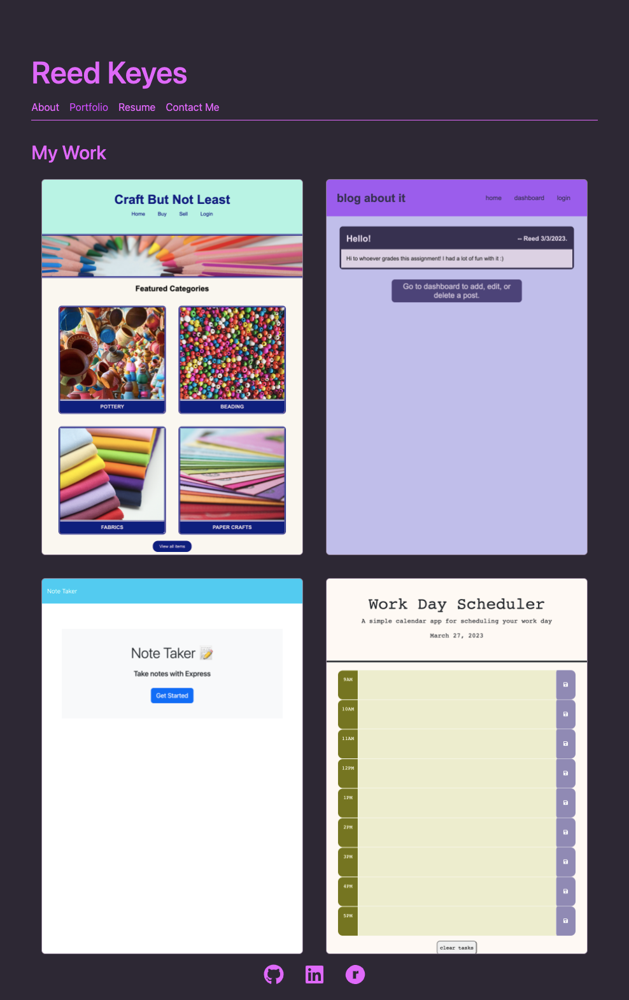

# rbk-react-portfolio

## Description

My personal portfolio page, including a brief bio, samples of my latest work, a copy of my resume, and contact information.

Technologies used include:

- node.js
- react
- bootstrap
- react-bootstrap

This is a single-page application build using react. It includes components for the Header, Nav, and Footer, which are rendered on each page. 

The About page displays a brief bio. *Note:* current bio is placeholder text, will be updated upon completion of boot camp. 

The Portfolio page displays project cards with links to each deployed project and the associated github repo. Each project card is rendered to the page using the Project component.

The ContactForm page contains my current contact information as well as a contact form. *Note:* contact form does not submit as there is no backend to the application yet. Functionality to be added in future development. 

The Resume page displays my resume information, with a button to download a PDF copy of the resume. *Note:* resume is not up to date, will be updated upon completion of boot camp.

The application was styled using a combination of bootstrap css, react-bootstrap, and custom css. Icons used are from react-icons.

This application was deployed using GitHub Pages.

## Table of Contents

- [Usage](#usage)

- [Credits](#credits)

- [License](#license)

- [Tests](#tests)

- [Contact](#contact)

## Usage

Navigate to the [homepage](https://rbkeyes.github.io/rbk-react-portfolio/). Use the navigation links in the header to explore the pages. Links in footer direct the user to my [github profile](https://github.com/rbkeyes), [linkedIn profile](https://www.linkedin.com/in/reedkeyesrd/), and [ravelry page](https://www.ravelry.com/people/highfiberhabit). *Note:* ravelry link is a placeholder for now.

## Credits

Coursework for the bootcamp was used as reference material in completing this project.

Documentation for [React](https://react.dev/) was incredibly helpful.

I also relied on documentation for [bootstrap](https://getbootstrap.com/) and [react-bootstrap](https://react-bootstrap.github.io/).

Filler text courtesy of [hipster ipsum](https://hipsum.co/?paras=5&type=hipster-centric).

I followed [this tutorial](https://www.geeksforgeeks.org/how-to-download-pdf-file-in-reactjs/) by geeksforgeeks for help with adding the file download for the Resume page.

No starter code was provided for this project.

## License

[MIT license](./LICENSE)

## Tests

There are no tests at this time.

## Contact

Still have questions? Find me on [GitHub](https://github.com/rbkeyes).

Or, you can [email me](mailto:rbkeyes@gmail.com).

## Credits

[React-Icons](https://react-icons.github.io/react-icons/icons?name=fa) documentation was referenced to import and utilize icons in the application.

[Configure React Icons](https://github.com/react-icons/react-icons).

